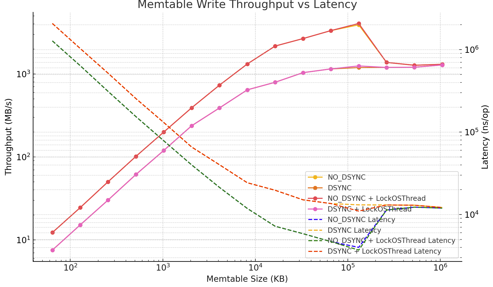

# Memtable Performance Benchmark (DirectIO + Go)

This benchmark evaluates a single-threaded, append-only, `O_DIRECT`-backed memtable implementation in Go. The design mimics ScyllaDB’s core-local memtables and flush logic, emphasizing high throughput and stable latencies.

## 🔧 Benchmark Configuration

- **CPU**: AMD Ryzen 7 9800X3D
- **Memtable Write Size**: 16KB per record
- **Concurrency**: Single-threaded (8 goroutines pipelined into one locked OS thread)
- **Flush Trigger**: Memtable capacity exceeded
- **IO Mode**: DirectIO (`O_DIRECT`), Append-only
- **Benchmark Tool**: `go test -bench`

---

## 📊 Performance Overview (NO_DSYNC vs DSYNC)

| Capacity | RPS (NO_DSYNC) | Latency (ns/op) | RPS (DSYNC) | Latency (ns/op) |
|---------:|---------------:|----------------:|------------:|----------------:|
| 64KB     |       785       |     1,273,903    |     482     |   2,073,246      |
| 128KB    |      1,568      |       637,656    |     970     |   1,030,739      |
| 256KB    |      3,214      |       311,103    |    1,934     |     517,106      |
| 512KB    |      6,499      |       153,871    |    3,930     |     254,432      |
| 1MB      |     12,769      |        78,317    |    7,659     |     130,561      |
| 2MB      |     25,013      |        39,979    |   15,186     |      65,849      |
| 4MB      |     46,907      |        21,319    |   24,932     |      40,110      |
| 8MB      |     84,494      |        11,835    |   41,206     |      24,268      |
| 16MB     |    138,896      |         7,200    |   50,840     |      19,670      |
| 32MB     |    170,877      |         5,852    |   66,387     |      15,063      |
| 64MB     |    213,214      |         4,690    |   73,646     |      13,579      |
| 128MB    |    250,319      |         3,995    |   76,413     |      13,087      |
| 256MB    |     88,229      |        11,334    |   76,672     |      13,043      |
| 512MB    |     81,517      |        12,267    |   77,174     |      12,958      |
| 1GB      |     83,717      |        11,945    |   82,203     |      12,165      |

---

## 📉 Throughput vs Latency (Log Scale)

> Left axis: Throughput in MB/s (log scale)  
> Right axis: Latency in ns/op (log scale)  
> X-axis: Memtable size (KB, log scale)

---

## 🔁 Flush Frequency Trend

- Smaller memtables trigger frequent flushes, degrading both throughput and latency.
- Flush frequency stabilizes beyond **8–16MB**, where throughput growth starts to plateau.

---

## 🔒 `runtime.LockOSThread()` Impact

To ensure predictable syscall behavior with `O_DIRECT` (DirectIO) and aligned memory buffers, we benchmarked with and without `runtime.LockOSThread()`.

| Capacity | RPS (No Lock) | Latency (ns/op) | RPS (LockOSThread) | Latency (ns/op) |
|---------:|--------------:|----------------:|--------------------:|----------------:|
| 128MB    | ~220,000      | ~5,500          | **250,319**         | **3,995**       |
| 256MB    | ~85,000       | ~11,000         | **88,229**          | **11,334**      |
| 1GB      | ~81,000       | ~12,000         | **83,717**          | **11,945**      |

✅ **Locking OS threads**:
- Reduces context-switching overhead
- Ensures aligned buffers remain valid (important for `O_DIRECT`)
- Prevents `EINVAL` during write() syscalls
- Better latency consistency

---

## 🧠 Final Conclusions

- **Memtable Size Matters**: Performance improves linearly with size up to 128MB. Beyond that, throughput plateaus.
- **DSYNC vs NO_DSYNC**: DSYNC incurs 1.5–2x higher latency at small sizes but converges at 512MB+. Use DSYNC if durability is essential.
- **DirectIO Requirements**: `runtime.LockOSThread()` is highly recommended for DMA-safe writes, especially in single-threaded core-local memtable designs.
- **Flush Design**: Scylla-like batching improves throughput. Flushes can be run on the same core if they yield properly between IO calls.

---

## 🧪 Design Inspiration

This experiment was inspired by **ScyllaDB’s core-local architecture**:
- Per-core memtables
- Flush triggered by memory thresholds
- IO parallelism via sharded threads

This design brings similar performance characteristics to a Go-based system using low-level syscalls and memory alignment.

---

## 📂 Future Work

- Add WAL benchmarking
- Integrate `io_uring` for flush batching
- Explore compression + zero-copy read path

---

Made with ❤️ by [BharatMLStack](https://github.com/Meesho/BharatMLStack)
